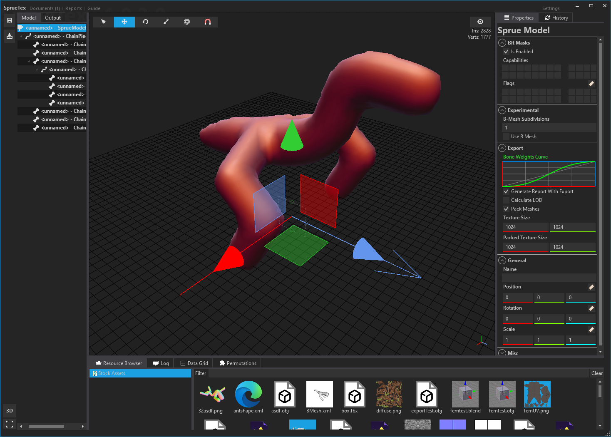

Depends on a modified version of MonoGame (https://github.com/JSandusky/MonoGame/commits/develop/) that exposes CBuffers for raw data writes among a few other things.

itch.io page: https://spruekit.itch.io/spruetex

This began in C++/QT5 and was migrated over to WPF/C# + C++/CLI. Most of the unused C++ code is expected to work (where not obviously stubbed) as the primary issues were QT related. C++/CLI pretty much damned the project though and it was time for either another heavy refactor (back to more C++ centric so 3rd party integrations of the runtime were more viable).

Was first a Spore style creature modeler, but procedural texture-graphs were more viable so it went that direction.